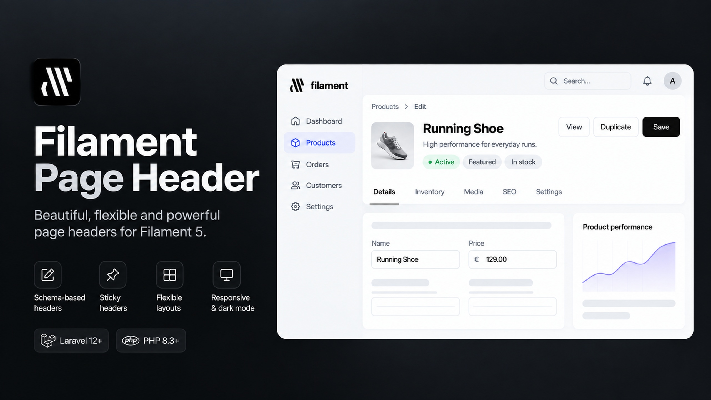
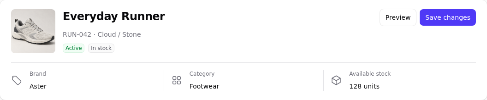
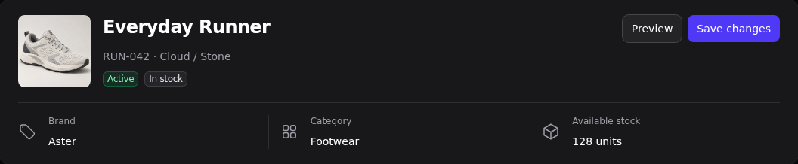
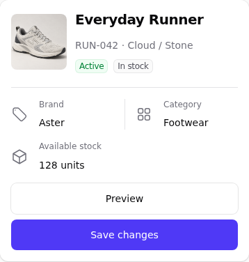
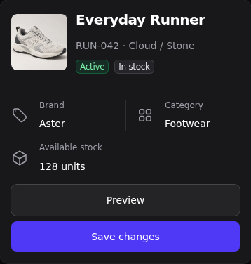

# Filament Page Header

[](https://packagist.org/packages/mortalkiller/filament-page-header)
[](https://packagist.org/packages/mortalkiller/filament-page-header)
[](https://github.com/mortalkiller/filament-page-header/actions/workflows/tests.yml)
[](LICENSE.md)

[](https://plumbphp.dev/mortalkiller/filament-page-header)
[](https://plumbphp.dev/mortalkiller/filament-page-header)
[](https://plumbphp.dev/mortalkiller/filament-page-header)
[](https://plumbphp.dev/mortalkiller/filament-page-header)
[](https://plumbphp.dev/mortalkiller/filament-page-header)

Build informative, responsive page headers with native **Filament 4 and 5** schemas. Combine identity, status, metadata and page actions, then choose what stays visible while scrolling.

Enable headers only on the panels and pages you choose. No custom theme build, application-specific models or required icon library.

## Documentation

Full documentation, guides and API reference:

**https://docs.pedromonteiro.dev/filament-page-header/**

- [Getting started](https://docs.pedromonteiro.dev/filament-page-header/getting-started/installation/)
- [Configuration guide](https://docs.pedromonteiro.dev/filament-page-header/guides/configuration/)
- [API reference](https://docs.pedromonteiro.dev/filament-page-header/api/)

## Contents

- [Documentation](#documentation)
- [Features](#features)
- [Screenshots](#screenshots)
- [Version compatibility](#version-compatibility)
- [Installation](#installation)
- [Generator](#generator)
- [Your first header](#your-first-header)
- [Configuration](#configuration)
- [Header navigation](#header-navigation)
- [Sticky and compact modes](#sticky-and-compact-modes)
- [Migration from v1](#migration-from-v1)
- [Troubleshooting](#troubleshooting)
- [Testing and contributing](#testing-and-contributing)
- [Changelog](#changelog)
- [Roadmap](#roadmap)
- [Security](#security)
- [Support this project](#support-this-project)
- [Credits and license](#credits-and-license)

## Features

- Headings, descriptions, badges, avatars, initials and product images.
- Native schema fields for metadata and summary metrics, with responsive separators.
- Field icons before or after the complete label/value, with configurable size.
- Native page actions aligned right on desktop and after the details on mobile.
- Breadcrumb positioning and optional native page/record sub-navigation inside the header.
- Normal, sticky and compact layouts, with configurable responsive thresholds.
- Typed compact configuration: keep entire blocks or select individual fields.
- Native light/dark colors, keyboard focus handling and reduced-motion support.
- Shared resource schemas, with individual page overrides.
- Artisan generator for conventional header schemas and Resource page setup.

## Screenshots

Real captures of the package's product demo: a product image, two actions and three information fields. The example uses fictional product data, English labels and a native indigo/gray palette. The product image and banner are illustrative assets; the header itself is rendered by Filament. Native action colors follow your panel configuration.

| Layout | Light | Dark |
| --- | --- | --- |
| Desktop |  |  |
| Compact after scrolling |  |  |
| Mobile |  |  |

[Run the demo locally](docs/testing.md) to explore the layouts and native actions.

## Version compatibility

This README documents **2.x**. Package major versions identify this package's API; they do not correspond to Filament major versions.

| Package version | Filament requirement | PHP requirement | Laravel | API |
| --- | --- | --- | --- | --- |
| `^2.0` | `^4.12.6 \|\| ^5.8.1` | `^8.3` | 12 or 13 | `Header`, `MetadataEntry`, typed compact configuration |
| `^1.0` | `^5.8.1` | `^8.3` | 12 or 13 | Previous `HeaderLayout` API |

Version 2 runs its PHP suite against the minimum secure Filament 4 release (`4.12.6`), the latest release resolved by `^4.12.6`, the minimum Filament 5 release (`5.8.1`) and the latest release resolved by `^5.8.1`, across Laravel 12 and 13, including PHP 8.5 on the latest dependency boundaries. The Chromium suite runs on the minimum supported Filament 4 release and the latest release resolved by `^5.8.1`. Versions before `4.12.6` are outside the declared requirement; Composer specifically blocks `4.0.0` and `4.12.0`–`4.12.5` because of known security advisories. Filament `5.0`–`5.8.0` is also outside the declared requirement and has not been validated. Other Filament majors are outside these releases' requirements. PHP must also satisfy your selected Laravel version's requirements.

See the [1.x README](https://github.com/mortalkiller/filament-page-header/blob/1.x/README.md) for the previous API and the [verification record](docs/verification.md) for executed checks. Security maintenance is documented separately in the [security policy](SECURITY.md).

## Installation

### 1. Install the package

```bash
composer require mortalkiller/filament-page-header:^2.0
```

### 2. Publish Filament assets

```bash
php artisan filament:assets
```

The service provider is discovered automatically. There are no package migrations to run and no custom theme build is required.

### 3. Register the plugin

Add the plugin to the intended panel's existing configuration:

```php
use MortalKiller\FilamentPageHeader\PageHeaderPlugin;

$panel->plugin(PageHeaderPlugin::make());
```

Register it separately for each panel that needs custom headers, then add the page trait as shown below. Installation alone does not replace existing headers.

## Generator

For an existing Filament Resource, generate the conventional header schema and choose which standard Resource pages should use it:

```bash
php artisan make:filament-page-header OrderResource
```

For explicit or non-interactive usage:

```bash
php artisan make:filament-page-header OrderResource \\
    --panel=admin \\
    --page=list \\
    --page=view \\
    --page=edit
```

Use `--no-pages` to generate only the schema and `--force` to deliberately replace an existing generated schema. Repeated runs do not duplicate `HasPageHeader` imports or trait declarations.

See the [generator guide](docs/generator.md) for page selection, multi-panel applications, existing schemas and supported page types.

## Your first header

For an existing `CustomerResource`, add `HasPageHeader` and `headerSchema()` to its Edit page. This example assumes the model has `name` and `email` attributes; retain your page's existing methods and actions.

```php
<?php

namespace App\Filament\Resources\Customers\Pages;

use App\Filament\Resources\Customers\CustomerResource;
use Filament\Resources\Pages\EditRecord;
use Filament\Schemas\Schema;
use Illuminate\Database\Eloquent\Model;
use MortalKiller\FilamentPageHeader\Components\Header;
use MortalKiller\FilamentPageHeader\Concerns\HasPageHeader;

class EditCustomer extends EditRecord
{
    use HasPageHeader;

    protected static string $resource = CustomerResource::class;

    public function headerSchema(Schema $schema): Schema
    {
        return $schema->components([
            Header::make()
                ->heading(fn (Model $record) => $record->getAttribute('name'))
                ->description(fn (Model $record) => $record->getAttribute('email'))
                ->initials(fn (Model $record) => $record->getAttribute('name')),
        ]);
    }
}
```

The trait also works with Create, View, List and custom pages. Use nullable record closures where no record exists. `Header::make()` inherits the page heading and subheading by default and does not change the browser tab title. By default, the header schema uses the page's current Resource record; override [`getPageHeaderRecord()`](docs/configuration.md#record-and-context-resolution) for tenant, parent, singleton, custom-model or array-backed contexts.

## Configuration

Use native Filament entries for content and keep business logic in your application. The package handles layout, images, spacing and light/dark appearance.

| Configure | API | Guide |
| --- | --- | --- |
| Identity | `heading()`, `description()`, `avatar()`, `image()`, `initials()`, `icon()`, `initialsBgColor()`, `initialsTextColor()`, `iconBgColor()`, `iconColor()` | [Images and icons](docs/configuration.md#images-and-icons) |
| Badges and details | `badges()`, `metadata()`, `summary()` | [Layout slots](docs/configuration.md#layout-slots) |
| Field icons | `fieldIcon()`, `fieldIconPosition()`, `fieldIconSize()` | [Metadata fields](docs/configuration.md#metadata-separators-and-field-icons) |
| Product identity | `image()` and `descriptionSchema()` | [Product example](docs/configuration.md#product-header-example) |
| Reusable resource headers | Convention discovery or `schemaFor()` | [Shared configuration](docs/configuration.md#share-configuration-across-a-resource) |
| Record/context | `getPageHeaderRecord()` | [Custom record contexts](docs/configuration.md#record-and-context-resolution) |
| Custom composition | `headingSchema()`, `leading()`, `schema()` | [Layout slots](docs/configuration.md#layout-slots) |

Native `getHeaderActions()` continues to define the page actions. They render once, right-aligned on desktop and after the details on mobile. Native button groups, modals, form targets and authorization remain in place. Breadcrumbs sit outside the card and scroll with the page by default. [Configure their position and native sub-navigation](#header-navigation) when needed.

Color an initials fallback with a panel color alias or a native Filament palette. The text color is chosen for contrast unless you override it:

```php
use Filament\Support\Colors\Color;
use Filament\Support\Icons\Heroicon;

Header::make()
    ->initials(fn (Model $record) => $record->name)
    ->initialsBgColor('primary');

Header::make()
    ->initials(fn (Model $record) => $record->name)
    ->initialsBgColor(Color::Blue)
    ->initialsTextColor(Color::Blue);

Header::make()
    ->icon(Heroicon::OutlinedUser)
    ->iconBgColor('primary')
    ->iconColor(Color::Blue);
```

See [Images and icons](docs/configuration.md#images-and-icons) for imports, closures and fallback behavior.

For a resilient identity, configure image, initials and an icon together. The header renders one visual in this order: custom `leading()` content, a resolved avatar/image, initials, then `icon()`.

## Header navigation

Keep Filament's breadcrumbs outside the card (the default), place them inside, or hide them:

```php
use MortalKiller\FilamentPageHeader\Components\Header;
use MortalKiller\FilamentPageHeader\Enums\BreadcrumbPosition;

Header::make()->breadcrumbs(BreadcrumbPosition::Outside);
Header::make()->breadcrumbs(BreadcrumbPosition::Inside);
Header::make()->breadcrumbs(BreadcrumbPosition::Hidden);
```

Move existing native Page/Resource sub-navigation into the header with `subNavigation()`. Desktop uses Filament's horizontal tabs; mobile uses its dropdown. URLs, authorization, active state and SPA navigation stay native. No navigation is created if the page has none.

```php
use MortalKiller\FilamentPageHeader\CompactHeader;
use MortalKiller\FilamentPageHeader\Enums\HeaderPart;

Header::make()
    ->breadcrumbs(BreadcrumbPosition::Inside)
    ->subNavigation()
    ->compact()
    ->whenCompact(fn (CompactHeader $compact) => $compact
        ->show(HeaderPart::Breadcrumbs, HeaderPart::SubNavigation));
```

Inside breadcrumbs and sub-navigation hide when compact unless explicitly retained. Retained outside breadcrumbs remain outside the card but join the pinned header; otherwise they scroll with the page as before. Navigation supports `show()`, not `only()` field selection. `Hidden` and panel-level breadcrumb disabling remain authoritative.

`subNavigation()` integrates route navigation such as `getRecordSubNavigation()` and `ManageRelatedRecords` pages. **Relation Manager tabs remain in the page content**, including combined content tabs and their Before/After ordering. Without `subNavigation()`, Filament keeps its original Start/End/Top layout.

See [Navigation configuration](docs/configuration.md#breadcrumbs-and-sub-navigation) for details.

## Sticky and compact modes

Set a default on the panel plugin:

```php
PageHeaderPlugin::make(); // Scroll normally.
PageHeaderPlugin::make()->sticky(); // Keep the full header pinned.
PageHeaderPlugin::make()->compact(); // Compact when the header reaches the sticky edge.
PageHeaderPlugin::make()->sticky()->compactBelow(1024);
```

You can also call `normal()`, `sticky()` or `compact()` on an individual `Header`. Call `compactBelow()` after selecting the base mode; its threshold is exclusive.

By default, compact mode keeps the heading, image/avatar, badges and native page actions. Choose optional content explicitly with enums:

```php
use MortalKiller\FilamentPageHeader\CompactHeader;
use MortalKiller\FilamentPageHeader\Components\Header;
use MortalKiller\FilamentPageHeader\Enums\HeaderPart;

Header::make()
    ->compact()
    ->whenCompact(fn (CompactHeader $compact) => $compact
        ->show(HeaderPart::Image, HeaderPart::Badges)
        ->only(HeaderPart::Metadata, ['reference']));
```

Use this on a header whose metadata includes `reference`. Each `whenCompact()` callback starts with no optional blocks selected. The heading and native page actions always remain; field visibility and authorization still apply. Scrolling does not duplicate actions or send Livewire requests.

[Full compact configuration, offsets and responsive rules](docs/configuration.md#sticky-and-compact-modes).

## Migration from v1

Version 2 replaces `HeaderLayout` with `Header` and introduces a new composition API. Update consuming schemas and publish the assets again when upgrading.

Follow the [migration guide](docs/migration.md), including the deprecated compact methods. For unreleased development on `2.x`, deliberately use `2.x-dev` with the [local path and symlink workflow](docs/local-development.md); keep your application's global stability unchanged.

## Troubleshooting

| Symptom | Check |
| --- | --- |
| The native header still appears | Register the plugin on the active panel, add `HasPageHeader` to the page and return a non-empty schema. A page's own `getHeader()` method takes precedence. |
| Styling or scrolling behavior is outdated | Run `php artisan filament:assets` in the consuming application after updating the package, then reload. A Composer symlink does not refresh published assets. |
| The header does not stick | Enable `sticky()` or `compact()`. Check the real scroll container, short parent wrappers and ancestor overflow. Pinning is temporarily disabled when the header cannot fit the viewport. |
| `whenCompact()` has no visible effect | Enable `compact()` on the header or plugin, then scroll to the sticky edge. The callback selects content; it does not activate compaction. |
| A selected compact field disappears | Match its entry name or layout key, and check native visibility conditions. Selection covers direct fields, not nested descendants. |

[Advanced layout and offset configuration](docs/configuration.md#offset-and-compact-content).

## Testing and contributing

```bash
composer check
node --test tests/JavaScript/*.test.mjs
npm run test:browser
```

See [demo and testing setup](docs/testing.md) before running browser tests, and [CONTRIBUTING](CONTRIBUTING.md) for branch conventions, checks and pull requests. The package has an independent workbench and does not require a consuming application's database.

## Changelog

See [GitHub Releases](https://github.com/mortalkiller/filament-page-header/releases) for published versions and release notes.

## Roadmap

See the [project roadmap](docs/roadmap.md) for planned action-control improvements, along with the package's scope and design principles.

## Security

Please report vulnerabilities privately using the process in [SECURITY.md](SECURITY.md). Use GitHub Issues for ordinary bugs and feature requests.

Heading and description text are escaped by default. Enable `html: true` only for trusted markup prepared by your application. Native visibility is not an authorization boundary; keep permission checks on the server.

The Plumb badges display the latest external assessment, which may lag behind repository changes. They are not a security audit or a guarantee that the package has no vulnerabilities.

## Support this project

If this package saves you time, consider supporting its development. Your support helps maintain the package and improve its documentation.

[](https://buymeacoffee.com/mortalkiller)

## Credits and license

- [Pedro Monteiro (MortalKiller)](https://github.com/mortalkiller)
- [All contributors](https://github.com/mortalkiller/filament-page-header/graphs/contributors)
- Inspired by [Vitis Studio's Filament Header Schema](https://github.com/VitisStudio/filament-header-schema).
- Built on [Filament](https://filamentphp.com). See [third-party notices](THIRD_PARTY_NOTICES.md).

Licensed under the [MIT license](LICENSE.md).
